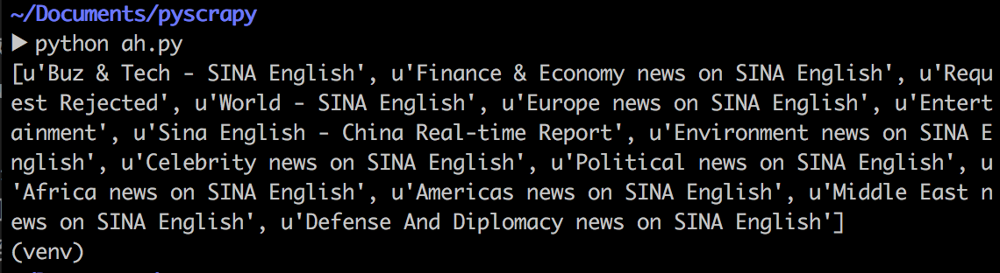
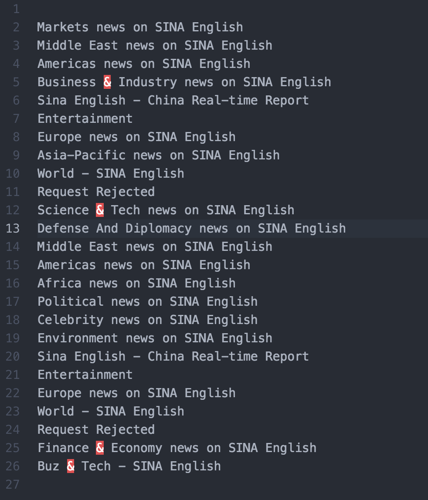

信息检索上机报告 
（一）

           
               

作者：康赣鹏

学号：14130140377

Email：1159838847@qq.com

教师：徐悦甡

上机地点：G314

实验工具：atom 

实验语言：Python 版本： 2.7.10

调用的模块：urllib2 re 工具：beautifulsoup
##一、上机说明
针对静态网页与普通动态网页

* 使用Java/Python等语言实现对于网页得Http请求
* 使用beautifulsoup等工具实现对于HTML标签内容的提取

##二、实验过程
安装开始前通过Pip安装好beautifulsoup
###实验思路
1. 调用urllib2模块中的urlopen()，根据已知的url打开该网页，并用read()读取该网页。
2. 用beautifulsoup对该html网页的信息进行提取，先将网页的标题存入list中，再根据beautifulsoup中的findAll()函数来对a标签进行提取。
3. 调用re模块中的compile()，并用正则表达式对网页中的url进行提取。正则表达式：r'href="([^"]*)"'  r'http'针对两种情况，并提取拼接好可访问的url，并将url添加到list中去。设置的提取的url链接数为20，当提取的url与本网页的url链接相同，则放弃该链接。
4. 针对中文网页，使用unicode对中文进行编码和译码。(unicode(html,'gb2312','ignore').encode('utf-8','ignore'))
5. 爬取过程：首先爬取某一url的html网页，提取并存储该网页的title和url于list中。然后，设置while循环，当list不为空时：访问list存储的url，并将title存储于文件中（之后会迭代出mongodb存储数据的版本）。当list中的url被pop空后，循环停止。这样，就实现了一层的广度优先遍历。

###核心代码
* 存储代码的数据结构：urllist = []（用于存储当前节点网页内提取的url），urllist2 = []（用于存储下一节点网页内提取的url）
，title = []（用于存储所有访问过的网页的title，存储后的title用于下一次实验的搜索）

* 核心代码
* 提取当前网页中的url
	 

		def grabHref(url):

    		html = urllib2.urlopen(url).read()
    		html = unicode(html,'gb2312','ignore').encode('utf-8','ignore')
    		soup = BeautifulSoup(html,"html.parser")
    		title.append(soup.title.string)

    		content = BeautifulSoup(html,"html.parser").findAll('a')

    		pat = re.compile(r'href="([^"]*)"')
    		pat2 = re.compile(r'http')
    		
    		count = 20
    		for item in content:
        	h = pat.search(str(item))
        	href = h.group(1)
        	if pat2.search(href):
          	  ans = href
        	else:
          	  ans = url+href

        	if ans == url:
          	  pass
        	else:
          	 	urllist.append(ans)
            	count -= 1
        	if count == 0:
          	  	break

* 访问urllist中存储的url，并将网页中的title存储在title[]中

		def grab(url):

    		html = urllib2.urlopen(url).read()
    		html = unicode(html,'gb2312','ignore').encode('utf-8','ignore')
    		soup = BeautifulSoup(html,"html.parser")
    		title.append(soup.title.string)

* 爬取过程中的两个循环

		while urllist:
    		temp = urllist.pop()
    		urllist2.append(temp)
    		grab(temp)

		while urllist2:
    		grabHref(urllist2.pop())

##三、实验结果
* 爬虫结束后title[]中存储的title
	*  
* 存储在文件中 
	*  

##四、实验感悟
* 要积极学习并调用工具来实现我们需要实现的功能
* 学会如何使用正则表达式来提取文档中所需的信息