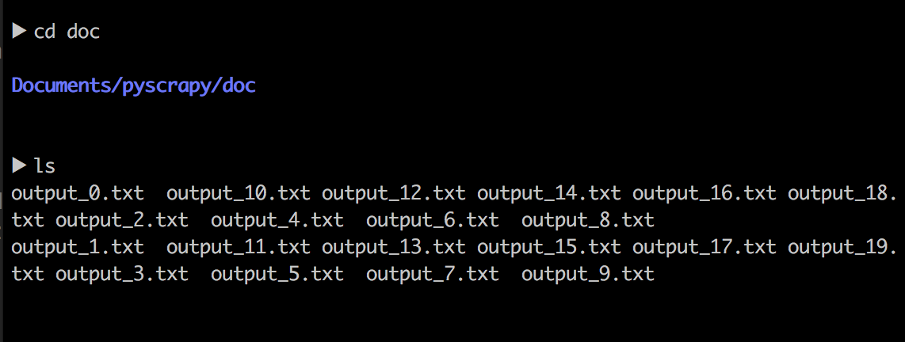
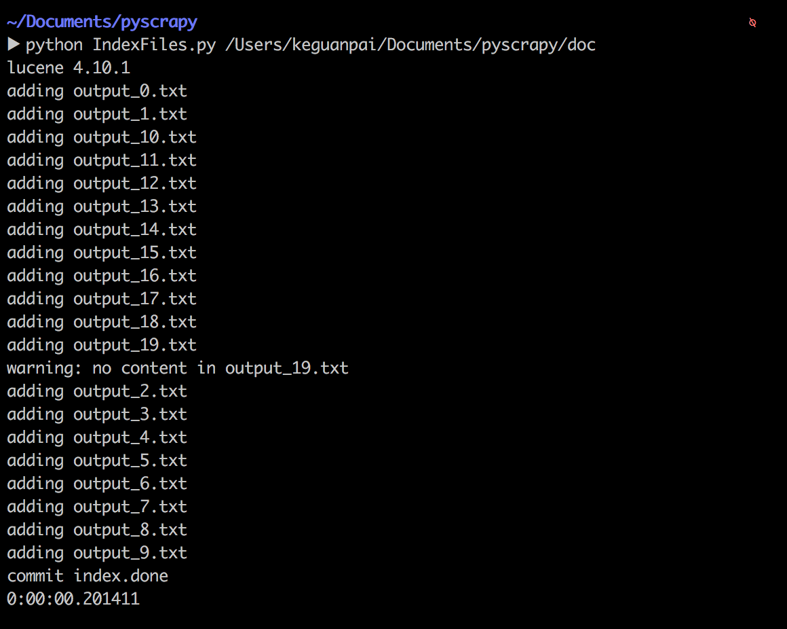
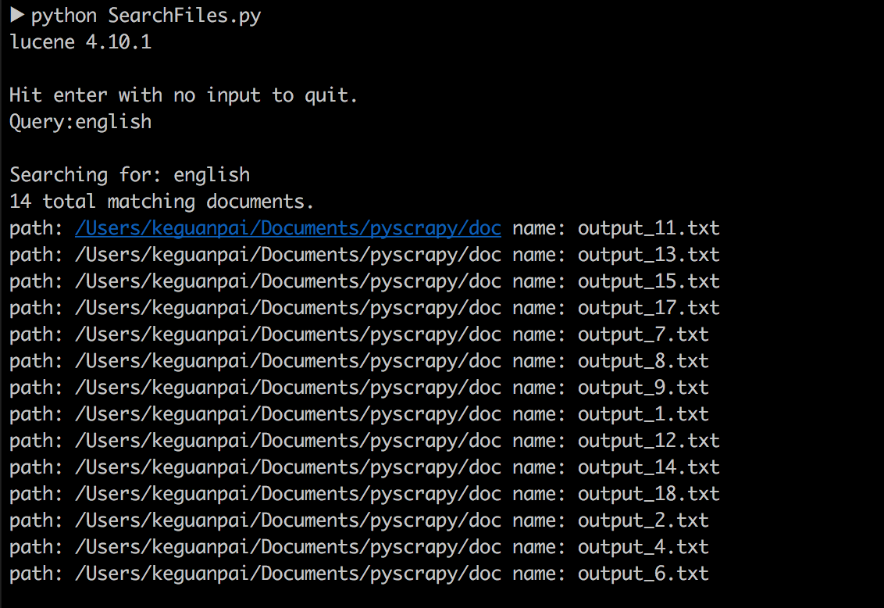
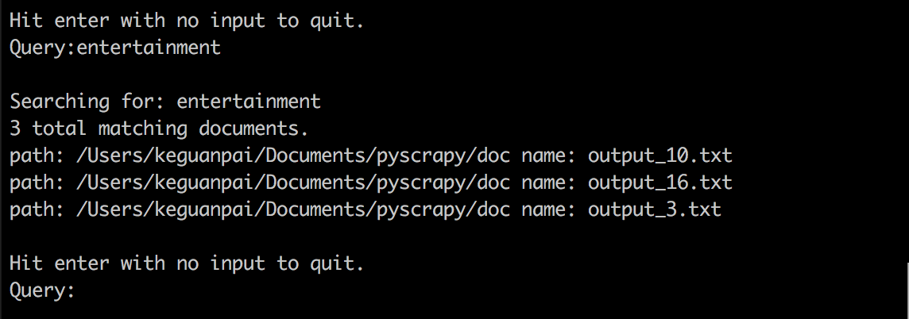

信息检索上机报告 
（二）

           
              

作者：康赣鹏

学号：14130140377

Email：1159838847@qq.com

教师：徐悦甡

上机地点：G314

操作系统：OS X 10.11.6

实验工具：atom 

实验语言：Python 版本： 2.7.10

调用的工具：Pylucene 版本：4.10.1-1

##一、Lucene及PyLucene
###Lucene 简介：
* Lucene 是一个基于 Java 的全文信息检索工具包，它不是一个完整的搜索应用程序，而是为你的应用程序提供索引和搜索功能。Lucene 目前是 Apache Jakarta 家族中的一个开源项目。也是目前最为流行的基于 Java 开源全文检索工具包。

###PyLucene 简介：
* PyLucene是Java版Lucene的Python版封装。这个工具的目标是让Python使用Lucene的文本索引和搜索能力

##二、安装PyLucene说明
1、安装ant

2、安装java for OX X 2015-001

3、进入下载好的PyLucene压缩包

4、安装jcc
> cd jcc 
> atom setup.py,查看java路径和python路径是否正确     
> python setup.py build 
> sudo python setup.py install

5、返回pylucene根目录，配置Makefile中的路径
>ANT=ant 
PYTHON=python 
JCC=$(PYTHON) -m jcc.__main__ --shared --arch x86_64 
NUM_FILES=8

6、make

7、make test

8、sudo make install

##三、实验过程
* 首先对实验一爬虫得来的文本数据进行分割，将每一行分割成一个txt文件，用于建立索引和检索
* 将剪切后的文件存储在该路径下：'/Users/keguanpai/Documents/pyscrapy/doc'

		import os
		import sys
		import os.path
		def split(file):
    		if not os.path.isfile(file):
        		print file,"is not a file"
        	exit(1)
    		txtfile=open(file,"r")

    		dirname='/Users/keguanpai/Documents/pyscrapy/doc'

    		file_index=0

    		line_cnt = 0
    		outfile=open(dirname+"/output_%d"%file_index+'.txt','w')
    		for line in txtfile:
        		if line_cnt < 1:
            		outfile.write(line)
            		line_cnt+=1
        		else:
            		outfile.close()
            		file_index+=1
            		outfile=open(dirname+"/output_%d"%file_index+'.txt','w')
            		line_cnt=0

    		outfile.close()
    		txtfile.close()

		split('/Users/keguanpai/Documents/pyscrapy/title.html')

* 存储索引文件名："IndexFiles.index"

		INDEX_DIR = "IndexFiles.index"
		
* 调用模块

		import sys, os, lucene, threading, time
		from datetime import datetime

		from java.io import File
		from org.apache.lucene.analysis.miscellaneous import LimitTokenCountAnalyzer
		from org.apache.lucene.analysis.standard import StandardAnalyzer
		from org.apache.lucene.document import Document, Field, FieldType
		from org.apache.lucene.index import FieldInfo, IndexWriter, IndexWriterConfig
		from org.apache.lucene.store import SimpleFSDirectory
		from org.apache.lucene.util import Version

* 

		class Ticker(object):
    		def __init__(self):
        		self.tick = True

    		def run(self):
        		while self.tick:
            		sys.stdout.write('.')
            		sys.stdout.flush()
            		time.sleep(1.0)
* 建立索引

		class IndexFiles(object):

    		def __init__(self, root, storeDir, analyzer):

        		if not os.path.exists(storeDir):
            		os.mkdir(storeDir)

        		store = SimpleFSDirectory(File(storeDir))
        		analyzer = LimitTokenCountAnalyzer(analyzer, 1048576)
        		config = IndexWriterConfig(Version.LUCENE_CURRENT, analyzer)
        		config.setOpenMode(IndexWriterConfig.OpenMode.CREATE)
        		writer = IndexWriter(store, config)

        		self.indexDocs(root, writer)
        		ticker = Ticker()
        		print 'commit index',
        		threading.Thread(target=ticker.run).start()
        		writer.commit()
        		writer.close()
        		ticker.tick = False
        		print 'done'

* 对某一文件路径内的txt文件建立索引

    		def indexDocs(self, root, writer):

* 针对t1，t2，设置索引，存储和标记

        		t1 = FieldType()
        		t1.setIndexed(True)
        		t1.setStored(True)
        		t1.setTokenized(False)
        		t1.setIndexOptions(FieldInfo.IndexOptions.DOCS_AND_FREQS)

       			t2 = FieldType()
        		t2.setIndexed(True)
        		t2.setStored(False)
        		t2.setTokenized(True)
        		t2.setIndexOptions(FieldInfo.IndexOptions.DOCS_AND_FREQS_AND_POSITIONS)

* 遍历指定文件路径下的txt文件，新建Document，用document的add()方法，一一建立索引，并最终用writer添加document。

        		for root, dirnames, filenames in os.walk(root):
            		for filename in filenames:
                		if not filename.endswith('.txt'):
                    		continue
                		print "adding", filename
                		try:
                    		path = os.path.join(root, filename)
                    		file = open(path)
                    		contents = unicode(file.read(), 'iso-8859-1')
                    		file.close()
                    		doc = Document()
                    		doc.add(Field("name", filename, t1))
                    		doc.add(Field("path", root, t1))
                    		if len(contents) > 0:
                        		doc.add(Field("contents", contents, t2))
                    		else:
                        		print "warning: no content in %s" % filename
                    		writer.addDocument(doc)
                		except Exception, e:
                    		print "Failed in indexDocs:", e

* main函数，执行建立索引的过程。
* 执行时，添加文件路径作为命令行参数

		if __name__ == '__main__':
    		if len(sys.argv) < 2:
        		print IndexFiles.__doc__
        		sys.exit(1)
    		lucene.initVM(vmargs=['-Djava.awt.headless=true'])
    		print 'lucene', lucene.VERSION
    		start = datetime.now()
    		try:
        		base_dir = os.path.dirname(os.path.abspath(sys.argv[0]))
        		IndexFiles(sys.argv[1], os.path.join(base_dir, INDEX_DIR),
                  	StandardAnalyzer(Version.LUCENE_CURRENT))
        		end = datetime.now()
        		print end - start
    		except Exception, e:
        		print "Failed: ", e
        		raise e

* 关键字搜索

		INDEX_DIR = "IndexFiles.index"

		import sys, os, lucene

		from java.io import File
		from org.apache.lucene.analysis.standard import StandardAnalyzer
		from org.apache.lucene.index import DirectoryReader
		from org.apache.lucene.queryparser.classic import QueryParser
		from org.apache.lucene.store import SimpleFSDirectory
		from org.apache.lucene.search import IndexSearcher
		from org.apache.lucene.util import Version

* 调用QueryParser来进行检索
* 检索到所有符合要求的文件后，打印出文件个数
* 并针对每个符合要求的文件，打印出对应的文件路径，及文件名

		def run(searcher, analyzer):
    		while True:
        		print
        		print "Hit enter with no input to quit."
        		command = raw_input("Query:")
        		if command == '':
            		return

        		print
        		print "Searching for:", command
        		query = QueryParser(Version.LUCENE_CURRENT, "contents",
                            analyzer).parse(command)
        		scoreDocs = searcher.search(query, 50).scoreDocs
        		print "%s total matching documents." % len(scoreDocs)

        		for scoreDoc in scoreDocs:
            		doc = searcher.doc(scoreDoc.doc)
            		print 'path:', doc.get("path"), 'name:', doc.get("name")

* main函数，执行检索过程

		if __name__ == '__main__':
    		lucene.initVM(vmargs=['-Djava.awt.headless=true'])
    		print 'lucene', lucene.VERSION
    		base_dir = os.path.dirname(os.path.abspath(sys.argv[0]))
    		directory = SimpleFSDirectory(File(os.path.join(base_dir, INDEX_DIR)))
    		searcher = IndexSearcher(DirectoryReader.open(directory))
    		analyzer = StandardAnalyzer(Version.LUCENE_CURRENT)
    		run(searcher, analyzer)
    		del searcher

##四、实验结果
* 分割爬虫得来的小文件

* 针对doc文件路径下的txt文件，建立索引

* 检索测试
* 检索english

* 检索entertainment

